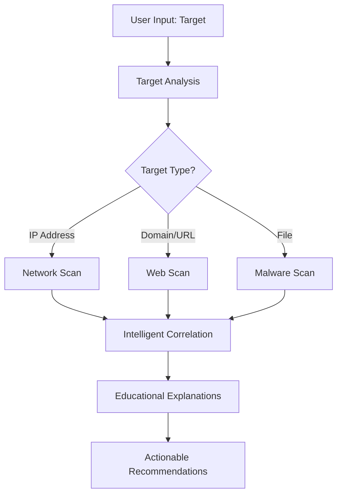

# SecOps CLI Wrapper 🛡️

**An Intelligent Cybersecurity Automation Tool with Built-in Learning**

[](https://python.org)
[](LICENSE)
[](https://github.com/your-username/secops-cli-wrapper)

## 🎯 What is SecOps CLI Wrapper?

SecOps CLI Wrapper is a beginner-friendly command-line tool that makes cybersecurity automation both **powerful** and **educational**. Unlike traditional security tools that just give you results, our tool teaches you *why* each step matters while performing real security assessments.

### ✨ Key Features

- **🧠 Smart Tool Selection**: Automatically chooses the right security tools based on your target (IP, domain, file, etc.)
- **🔄 Intelligent Workflows**: Chains security tools in logical sequences (port scan → web scan → analysis)
- **📚 Learning Mode**: Explains every action with educational context - perfect for students and beginners
- **🎨 Beautiful Output**: Clean, colorful results using Rich library
- **⚡ Cross-Platform**: Works on Windows, Linux, and macOS
- **🔧 Extensible**: Easy to add new security tools and learning modules

## 🚀 Quick Start

### Installation

```bash
# Clone the repository
git clone https://github.com/your-username/secops-cli-wrapper.git
cd secops-cli-wrapper

# Set up virtual environment
python -m venv venv
source venv/bin/activate  # On Windows: venv\Scripts\activate

# Install dependencies
pip install -r requirements.txt

# Install security tools (Ubuntu/Debian example)
sudo apt install nmap nikto clamav
```

### Basic Usage

```bash
# Scan a website with learning explanations
python main.py scan example.com --learn

# Quick port scan
python main.py scan 192.168.1.1

# Check which security tools are available
python main.py config --list-tools

# Interactive learning mode
python main.py learn
```

## 🎓 Why SecOps CLI Wrapper?

### Traditional Security Tools vs. SecOps CLI Wrapper

| Traditional Tools | SecOps CLI Wrapper |
|-------------------|-------------------|
| ❌ Complex syntax for beginners | ✅ Simple, intuitive commands |
| ❌ No explanation of results | ✅ Explains what each finding means |
| ❌ Manual tool selection | ✅ Automatically picks the right tools |
| ❌ Scattered results | ✅ Unified, correlated analysis |
| ❌ Steep learning curve | ✅ Learn cybersecurity while doing it |

### Perfect For:

- **🎓 Students** learning cybersecurity fundamentals
- **👨‍💻 Beginners** who want to understand security testing
- **🏢 Small teams** needing automated security assessments
- **📖 Self-learners** exploring penetration testing concepts

## 🛠️ How It Works



## 📁 Project Structure

```
SecOps-CLI-Wrapper/
├── main.py                 # Main CLI interface (Click framework)
├── decision_engine.py      # Smart tool selection logic
├── tool_wrappers.py        # Security tool integrations
├── learning_engine.py      # Educational content system
├── config.py              # Configuration management
├── utils.py               # Helper functions
├── requirements.txt       # Python dependencies
├── tests/                 # Test suite
├── docs/                  # Documentation
└── examples/              # Usage examples
```

## 🎯 Example Commands

### Basic Scanning
```bash
# Scan with automatic tool selection
python main.py scan scanme.nmap.org --learn

# Comprehensive scan with full explanations
python main.py scan target.com --intensity high --learn --verbose

# File malware scan
python main.py scan suspicious_file.exe
```

### Learning & Configuration
```bash
# Learn about scanning concepts
python main.py learn --topic scanning

# Check tool installation status
python main.py config --check-dependencies

# View supported security tools
python main.py config --list-tools
```

## 🧰 Supported Security Tools

| Tool | Purpose | Status |
|------|---------|--------|
| **Nmap** | Network/Port Scanning | ✅ Integrated |
| **Nikto** | Web Vulnerability Scanning | ✅ Integrated |
| **ClamAV** | Malware Detection | ✅ Integrated |
| **Custom Password Checker** | Password Strength Analysis | ✅ Built-in |
| **More tools** | Coming soon... | 🚧 Planned |

## 🎓 Educational Features

Our tool doesn't just scan - it teaches you cybersecurity:

- **📖 Concept Explanations**: Learn why each scan is important
- **🔍 Methodology Teaching**: Understand professional security assessment workflows  
- **🛡️ Defensive Perspective**: Learn how to protect against the vulnerabilities found
- **💡 Best Practices**: Industry-standard security recommendations
- **🎯 Hands-on Exercises**: Interactive learning modules

## 🚦 Sample Output

```
🎯 SecOps CLI Wrapper - Intelligent Security Automation

📋 Target Analysis: example.com
└── Target Type: Domain/Website
└── Recommended Workflow: Network Scan → Web Scan → Analysis

🔍 Phase 1: Network Discovery (Nmap)
├── 📚 Learning: Port scanning discovers services running on a target
├── ✅ Port 80 (HTTP) - OPEN
├── ✅ Port 443 (HTTPS) - OPEN  
└── 💡 Next: Web services detected, proceeding to web scan

🌐 Phase 2: Web Vulnerability Scan (Nikto)
├── 📚 Learning: Web scanners check for common security issues
├── ⚠️  Outdated server version detected
├── ⚠️  Directory listing enabled
└── 💡 Recommendation: Update server, disable directory browsing

📊 Summary & Next Steps:
└── 🎯 2 medium-risk findings detected
└── 📚 Learn more: python main.py learn --topic web-security
```

## 🤝 Contributing

We welcome contributions! Here's how you can help:

1. **🐛 Report Bugs**: Found an issue? Open a GitHub issue
2. **💡 Suggest Features**: Have ideas? We'd love to hear them
3. **🔧 Add Tools**: Integrate new security tools
4. **📚 Improve Learning**: Add educational content
5. **🧪 Write Tests**: Help us maintain code quality

### Development Setup

```bash
# Fork and clone the repository
git clone https://github.com/your-username/secops-cli-wrapper.git

# Install development dependencies
pip install -r requirements.txt
pip install pytest black pylint

# Run tests
pytest tests/ -v

# Format code
black .
```

## 📋 Requirements

- **Python**: 3.8 or higher
- **Operating System**: Windows, Linux, or macOS
- **Security Tools**: Nmap, Nikto, ClamAV (installation instructions provided)
- **Python Packages**: Listed in `requirements.txt`

## 🚧 Roadmap

- [x] ✅ Core CLI framework with Click
- [x] ✅ Basic tool integration (Nmap, Nikto, ClamAV)
- [x] ✅ Learning mode with explanations
- [x] ✅ Intelligent target analysis
- [ ] 🚧 Machine learning for better tool selection
- [ ] 🚧 Web dashboard interface
- [ ] 🚧 Plugin system for community tools
- [ ] 🚧 Advanced correlation algorithms
- [ ] 🚧 Automated report generation

## 📜 License

This project is licensed under the MIT License - see the [LICENSE](LICENSE) file for details.

## 🙏 Acknowledgments

- Built during summer training in cybersecurity
- Inspired by the need for beginner-friendly security automation
- Thanks to the open-source security community
- Special thanks to the maintainers of Nmap, Nikto, and ClamAV

## 📞 Support & Contact

- 🐛 **Issues**: [GitHub Issues](https://github.com/your-username/secops-cli-wrapper/issues)
- 💬 **Discussions**: [GitHub Discussions](https://github.com/your-username/secops-cli-wrapper/discussions)
- 📧 **Email**: your.email@example.com

---

⭐ **Star this repository if you find it helpful!** ⭐

**Made with ❤️ for the cybersecurity learning community**
